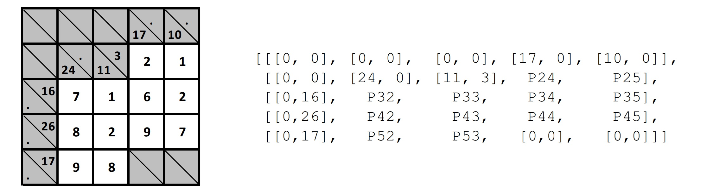
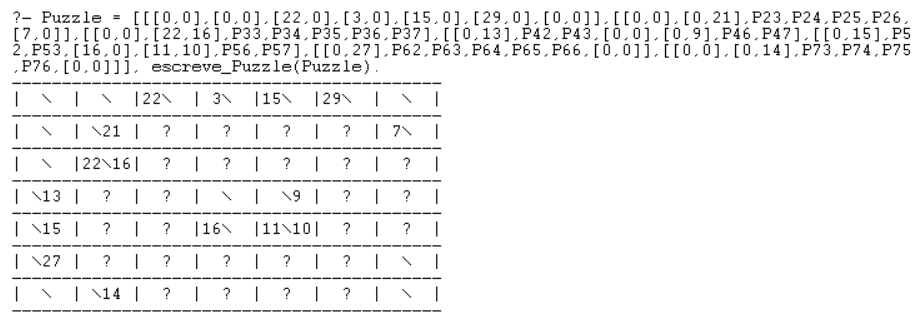
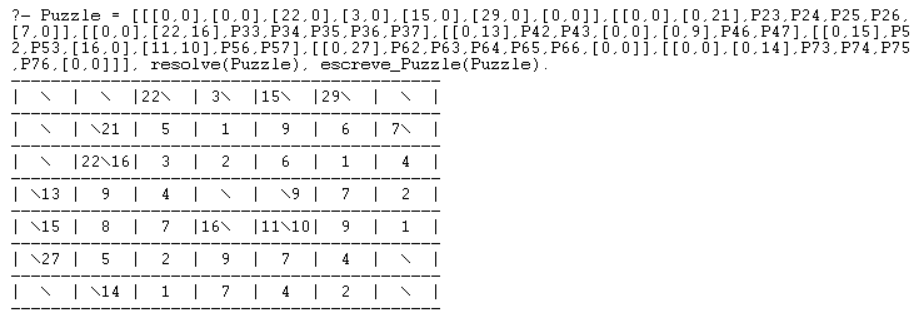
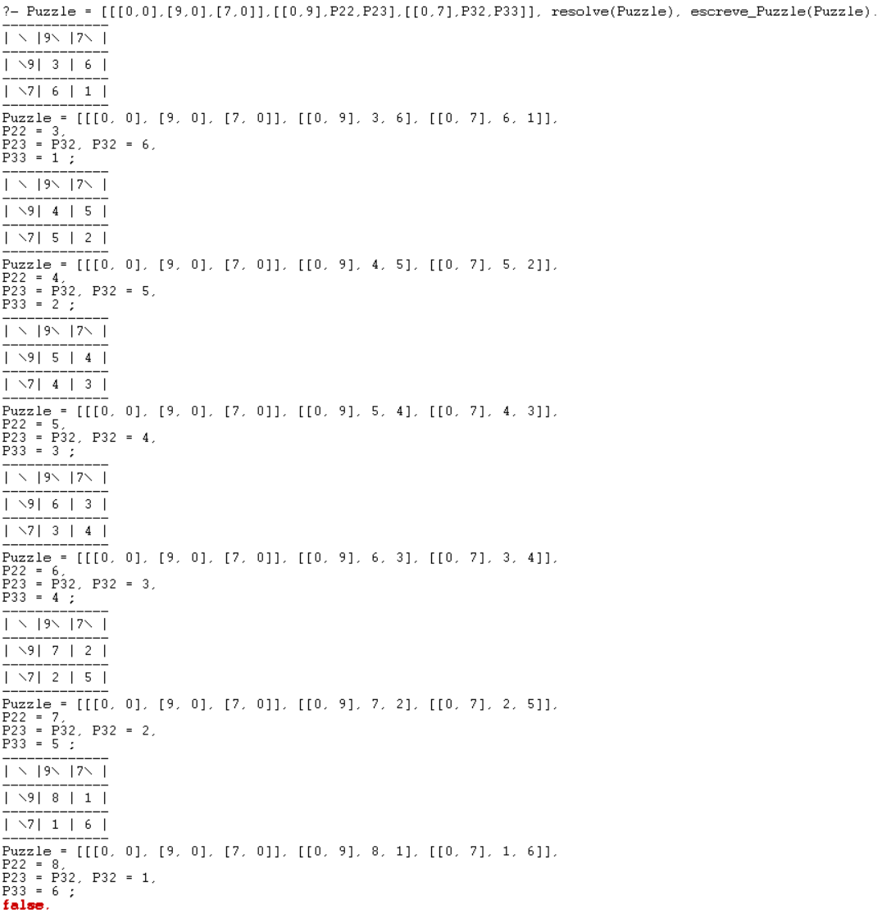

# Kakuro Puzzle Solver

A Kakuro Puzzle solver witten in Prolog, in pure declarative Logic Programming fashion.

## Description

Format of a Puzzle: a list of sublists, where each sublist is a row of the Puzzle. Elements of a sublist can be variables, i.e. empty positions, or a list of two elements, [S_v, S_h], respectively, vertical and horizontal sums. If either sum does not exist it is represented by 0. Example:



[puzzles_publicos.pl]([puzzles_publicos.pl]) contains more examples.

## Getting Started

### Dependencies

* SWI-Prolog
* library(clpfd)

### Executing program

In SWI-Prolog's REPL input `working_directory(_, <path/to/proj.pl>).` to change directories. [proj.pl](proj.pl) uses [codigo_comum.pl](codigo_comum.pl), which contains auxiliary code provided by teachers. Once [proj.pl](proj.pl) is loaded ( with `['proj.pl'].`), a Puzzle can be solved with the query:

```
Puzzle = [...], resolve(Puzzle), escreve_Puzzle(Puzzle).
```

`escreve_Puzzle` prints the Puzzle



and `resolve(Puzzle)` solves it



If a Puzzle has multiple solutions, subsequent solutions can queried by typing `;`


